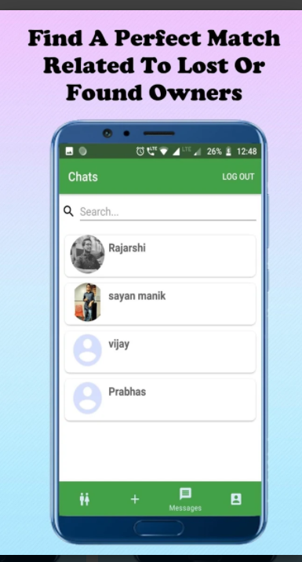

# NewLostAndFound

  
  
  
  
  Suppose you have lost your Driving license some where near your home. Now it will be very daunting task to find out that and also you will get panicked.Right???
But now no need to get worried about that. Because our Android app exactly solves this problem. 
Suppose you(let’s say your name is “XYZ”) lost an item which someone(let’s say his/her name is “ABC”) found. Now the person “ABC” can post the image of the item with description and date & time. Now when you search for the item in a particular location your very lost item is visible in the app’s feed. Don’t worry you also can post about your lost item. There is two different categories for users--”Lost”,”Found”.
Now you must be worried about getting back the item. We have solution for that too. There is Chat Feature to chat with “ABC”. 
You also can get all the details of your posts in our app.
We have used FirebaseAuthentication,FirebaseDatabase,FirebaseStorage,Android Studio IDE,Github,MapBox sdk.
